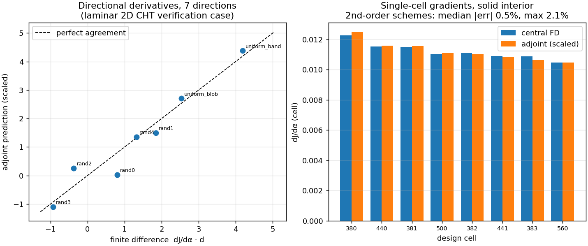
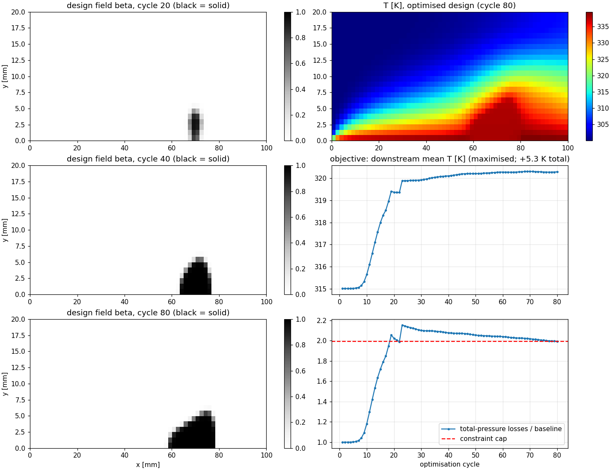

# thermalTopO

**Conjugate-heat-transfer topology optimisation for OpenFOAM's adjoint framework.**

`thermalTopO` extends the topology-optimisation capability of
`adjointOptimisationFoam` (OpenFOAM v2512) with the thermal physics it
currently lacks: a temperature equation in the primal, the corresponding
adjoint temperature equation with its coupling into adjoint momentum,
thermal objective functions, and the conductivity-interpolation term in the
topology sensitivities. With it, the existing porosity-based topology
optimisation — including the upstream constrained update methods
(ISQP / nullSpace / MMA) and the fully differentiated k-ω SST adjoint —
can optimise cooling geometries for thermal objectives such as *minimise
peak wall temperature subject to a pressure-drop cap*.

Developed and released by [Fira Software Ltd](https://firasoftware.com)
(author: Dr S. Kalogerakos), July 2026. Motivated by heat-exchanger and
high-heat-flux cooling design problems, including the topology optimisation
of coolant channels in fusion plasma-facing components.

> This offering is not approved or endorsed by OpenCFD Limited, producer
> and distributor of the OpenFOAM software via www.openfoam.com, and owner
> of the OPENFOAM and OpenCFD trade marks.

## What it adds

| Component | Class | Status |
|---|---|---|
| Primal SIMPLE + energy equation over the design field | `thermalSimple` | working, verified |
| Adjoint SIMPLE + adjoint energy equation and Ta∇T momentum coupling | `thermalAdjointSimple` | working, verified |
| Zone-mean temperature objective | `objectiveMeanTemperature` | working, FD-verified |
| Patch p-norm (peak-surrogate) temperature objective | `objectivePatchTemperaturePNorm` | working |
| Conductivity term in topology sensitivities | via `topOSensMultiplier` hook | working, FD-verified |
| Bergles–Rohsenow onset-of-nucleate-boiling monitor | `boilingOnsetBerglesRohsenow` functionObject | working |

Everything plugs into unmodified OpenFOAM v2512 through its runtime-selection
and sensitivity extension points; no core sources are patched.

## Verification (gradient correctness)

Continuous-adjoint gradients are verified against central finite
differences on a 2D laminar conjugate-heat-transfer case (Brinkman sponge,
conductivity ratio 100, hot wall, mean-temperature objective on a
downstream zone); every constituent solve converged to machine-level
residuals with automated guards:



- **Single-cell central FD, solid interior, consistent 2nd-order schemes:
  zone-mean objective median |error| 0.5 % (max 2.1 %); patch p-norm
  objective median |error| 0.2 % (max 0.9 %)** - both objective classes
  meet the < 1 % laminar acceptance criterion of the derivation note. The
  p-norm campaign exercises the boundary-driven adjoint flux path used by
  peak-temperature objectives.
- **Production configuration (regularisation on, p-norm objective,
  chained sensitivities): all regimes verify to max 1.7 % per cell**
  (solid 0.5 % median, edge 0.6 %, sponge 1.2 %) - the design-step error
  localisation observed without regularisation vanishes, as predicted.
  Note for reproducers: with regularisation active compare FD against
  `topOSens<solver>` (enable `writeAllFields`), not `topologySens<solver>`,
  which upstream writes before the filter/projection chain rule.
- Directional derivatives across 720 design cells: 1–3 % on
  gradient-dominant directions.
- With 1st-order upwind advection the solid-interior error grows to a
  uniform ≈ +11 % — an advection-scheme-consistency effect, not a
  formulation error. Cells adjacent to *unfiltered* step discontinuities
  in the design field carry larger local errors; regularisation (on in
  any production run) removes that configuration by construction.
- Known v1 approximation: frozen turbulent thermal diffusivity in the
  adjoint energy equation (the momentum-side k-ω SST adjoint is the fully
  differentiated upstream one). Quantification on turbulent cases is on
  the roadmap.

Full derivation and verification protocol: [docs/derivation.md](docs/derivation.md).

## Build

Requires an OpenFOAM v2512 installation (openfoam.com line) with
development headers (`openfoam2512-default` Debian/Ubuntu package or
equivalent).

```bash
source /usr/lib/openfoam/openfoam2512/etc/bashrc
cd src && wmake
```

Produces `$FOAM_USER_LIBBIN/libthermalTopO.so`. Load it per case via
`libs ("libthermalTopO.so");` in `system/controlDict`.

## Usage sketch

In `system/optimisationDict`, select the thermal solver pair and add a
`thermal` sub-dictionary to both:

```
primalSolvers
{
    op1
    {
        type    incompressible;
        solver  thermalSimple;
        thermal
        {
            DFluid  1.72e-7;   // k_f / (rho_f cp_f)  [m2/s]
            DSolid  3.55e-5;   // k_s / (rho_f cp_f)  [m2/s]
            Prt     0.85;
            kInterpolation { function BorrvallPetersson; b 20; }
        }
        ...
    }
}
adjointManagers
{
    am1
    {
        primalSolver op1;
        adjointSolvers
        {
            as1
            {
                type    incompressible;
                solver  thermalAdjointSimple;
                thermal { /* same entries */ }
                objectives
                {
                    type incompressible;
                    objectiveNames
                    {
                        peakT
                        {
                            weight  -1e-6;   // small weight keeps adjoint
                                             // magnitudes solver-friendly
                            type    patchTemperaturePNorm;
                            patches (heatedWall);
                            P       12;
                        }
                    }
                }
                ...
            }
            // pressure-drop cap: standard adjointSimple + PtLosses with
            // isConstraint true; volume cap: null solver + topOVolume
        }
    }
}
```

Fields: `0/T` (primal temperature) and `0/Ta` (adjoint temperature,
dimensions `[0 2 -2 -1 0 0 0]`; fixedValue 0 at inlets *and* outlets,
fixedGradient elsewhere — the solver drives objective-patch gradients).
The Brinkman source is the upstream `topOSource` fvOption on `(U Ua)`;
initial designs are supplied through the `alpha` field.

Working examples under `cases/`: `fdcheck` (verification),
`demo2d` (heat-extraction maximisation under pressure-drop and volume
constraints). In the demo, the optimiser grows a sharp conductive fin on
the hot wall, improving the objective by +5.1 K while the nullSpace update
manages total-pressure losses to within a few per cent of the 2x-baseline
cap (still converging at cycle 40):



## Practical notes (learned the hard way)

- Solve `T` and `Ta` with tight inner tolerances (`relTol 0;`) — they are
  linear given the flow; loose inner solves turn convergence into a crawl.
- Do **not** under-relax `Ta`: even `relax(1.0)` clips for diagonal
  dominance against the current field and biases the fixed point. Leave
  `Ta` out of `relaxationFactors`.
- Near sharp Brinkman interfaces, prefer `bounded Gauss upwind` /
  `limitedLinear` over `cellLimited`-gradient `linearUpwind`: limiter
  flip-flop can stall SIMPLE at a constant residual plateau.
- Keep the thermal objective weight small (≈1e-6 for SI Kelvin-scale
  objectives): the adjoint fields of mean/peak-temperature objectives are
  physically enormous, and segregated adjoint loops are happier at small
  magnitudes. Scales cancel in the optimiser.
- The `nullSpace` update method has proven more robust than ISQP on
  badly scale-separated constraint sets in our tests.

## Licence

GPL-3.0-or-later (as required for OpenFOAM-linking code). Copyright (C)
2026 Fira Software Ltd.
